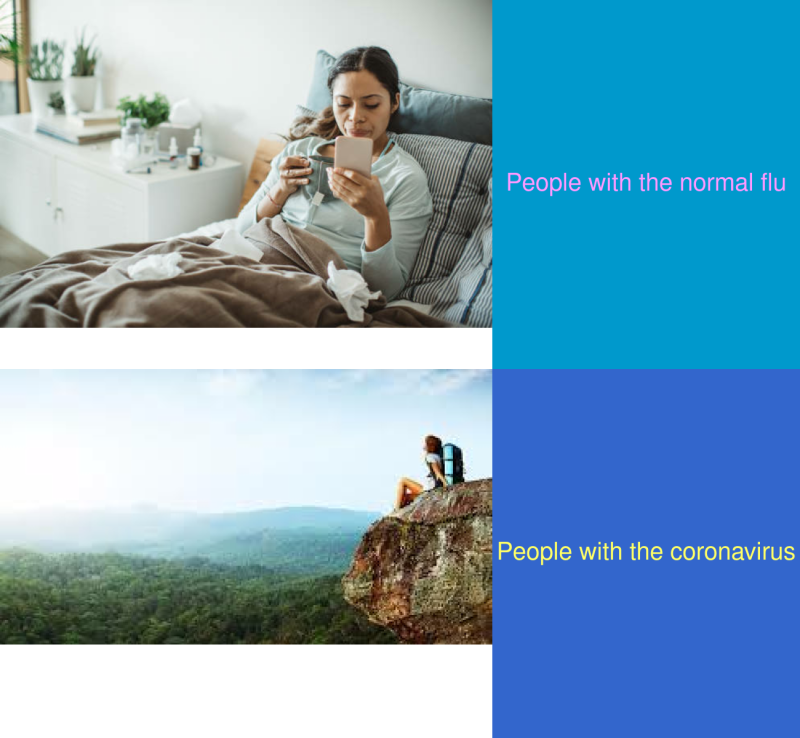

# *Hello world!*

Welcome to my stats220 website! 

## About me

I'm a student here in the university of Auckland double majoring in statistics and finance. **three things I like to do are drinking coffee, taking a beach walk, going on exciting events with my friends.** 

## It's so fun making memes!

My motivation for making this coronavirus meme was to add a dose of humor or sarcasm about the new realities of life during this pandemic, according to [APA](https://www.apa.org/news/press/releases/2021/10/covid-19-stress-humor) viewing memes helps to relieve stress and cope better in the era of COVID-19. 



What inspired me to create this *original* meme:

1. I wanted to make a meme that's very much relevant to our new reality and how people are coping  
2. I saw a meme of kanye west laughing at covid-19 memes at the start of the pandemic and another picture of him looking traumatized fast-forward 2022 LOL so I thought I should make one

### My meme.R **code** using code fences
```r
library(magick)
# first row
flu_person <- image_read("https://media.istockphoto.com/photos/common-cold-in-bed-picture-id1134952723?k=20&m=1134952723&s=612x612&w=0&h=bhFxubHEj_ui29RvvJuCRBpqrZ4tmvh9MnDLoQH9BAo=") %>%
  image_scale(800)
flu_person
# second row
coronavirus_person <- image_read("https://encrypted-tbn0.gstatic.com/images?q=tbn:ANd9GcTq3dIeMtY-6LtzPBu6QnHNs-GL8AmoLEhIYw&usqp=CAU") %>%
  image_scale(800)
coronavirus_person

normalsickpeople_text <- image_blank(width = 500, 
                                     height = 600, 
                                     color = "#0099cc") %>%
  image_annotate(text = "People with the normal flu",
                 color = "#ff99ff", 
                 size = 40,
                 font = "Impact",
                 gravity = "center")

coronavirus_text <- image_blank(width = 500,
                                height = 600,
                                color = "#3366cc") %>%
  image_annotate(text = "People with the coronavirus",
                 color = "#ffff66",
                 size = 40, 
                 font = "Impact",
                 gravity = "center")

# first/top row
top_row <- image_append(c(flu_person, normalsickpeople_text))

# second/bottom row
bottom_row <- image_append(c(coronavirus_person, coronavirus_text))

# making the whole thing!

meme <- c(top_row, bottom_row) %>%
  image_append(stack = TRUE) %>%
  image_scale(800)

image_write(meme,"my_meme.png")
```

